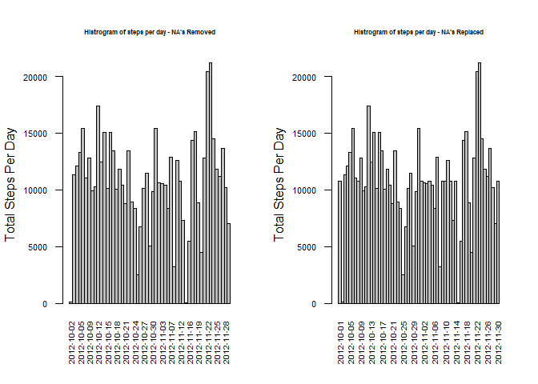

---
title: "Reproducible Research: Peer Assessment 1"
output: 
  html_document:
    keep_md: true
---


## Loading and preprocessing the data   

The data is initially imported using the read.csv function. It is read into a dataframe called MonData.  
Convert data column to POSIXct date fromat. The data file **activity.csv** will need to be in the working directory. 


```r
#Import Dataset
MonData<-read.csv("activity.csv")
MonData$date<-as.POSIXct(MonData$date,format="%Y-%m-%d")
```
   
## What is mean total number of steps taken per day?

   
The first step is to count the number of steps per day, format the data into a dataframe with approprate column data types and remove lines with NA's.  


```r
StepsPerDay<-sapply(split(MonData,MonData$date), function (x) colSums (x[1]))
StepsPerDayt<-as.data.frame(StepsPerDay)
Mydates<-substr(rownames(StepsPerDayt),1,10)
StepsPerDayt<-cbind(StepsPerDayt,Mydates)
rownames(StepsPerDayt)<-c()
StepsPerDayt<-as.data.frame(StepsPerDayt)
colnames(StepsPerDayt)<-c("TotalSteps","Date")
StepsPerDayt$Date<-as.POSIXct(StepsPerDayt$Date,format="%Y-%m-%d")
StepsPerDayNoNa<-StepsPerDayt[!is.na(StepsPerDayt$TotalSteps),]
StepsPerDayNoNa$TotalSteps<-as.numeric(as.character(StepsPerDayNoNa$TotalSteps))
```

Next step is plot an approprate Histrogram   


```r
#Plot Histogram
barplot(TotalSteps~Date,data=StepsPerDayNoNa,space=0, xlab="",ylab="Total Steps Per Day",las=2,cex.axis=0.7,cex=0.6,main="Histrogram showing steps per day")
```

<!-- -->

To dispay the mean and median of the step, the summary functon can be used:  


```r
#Smmary stats
summary(StepsPerDayNoNa$TotalSteps)
```

```
##    Min. 1st Qu.  Median    Mean 3rd Qu.    Max. 
##      41    8841   10765   10766   13294   21194
```


## What is the average daily activity pattern?

Process the data into a suitbale format. The stringr package will need to be installed.   


```r
library(stringr)
StepsTimeSeries<-sapply(split(MonData,MonData$interval), function (x) colMeans (x[1],na.rm=TRUE))
stepTimeSeriest<-as.data.frame(StepsTimeSeries)
MyMinutes<-as.numeric(substr(rownames(stepTimeSeriest),1,str_locate(rownames(stepTimeSeriest),"s")-2))
stepTimeSeriest<-cbind(stepTimeSeriest,MyMinutes)
rownames(stepTimeSeriest)<-c()
colnames(stepTimeSeriest)<-c("TotalSteps","Minutes")
```

Plotting a time series graph of the number of steps in 5 minute increments.   


```r
plot(stepTimeSeriest[,c(2,1)],type = "l",ylab= "Mean Steps",main="Mean Steps Across the Day")
```

<!-- -->

Finding and reporting the time interval with most steps.   


```r
startMin<-stepTimeSeriest[stepTimeSeriest$TotalSteps==max(stepTimeSeriest$TotalSteps),2]
print(paste("Which 5-minute interval, on average across all the days in the dataset, contains the maximum number of steps:- ",startMin,"-",startMin+5,"minutes" ))
```

```
## [1] "Which 5-minute interval, on average across all the days in the dataset, contains the maximum number of steps:-  835 - 840 minutes"
```


## Imputing missing values

Calculate the total number of missing values.   


```r
permiss<-mean(is.na(MonData$steps))

print(paste("Calculate and report the total number of missing values in the dataset:-",permiss*nrow(MonData)))
```

```
## [1] "Calculate and report the total number of missing values in the dataset:- 2304"
```


The missing values are replace with the mean values for that time interval.   


```r
#Replacing Na with average number of steps in time increment
library(stringr)
StepsTimeSeries<-sapply(split(MonData,MonData$interval), function (x) colMeans (x[1],na.rm=TRUE))
stepTimeSeriest<-as.data.frame(StepsTimeSeries)
MyMinutes<-as.numeric(substr(rownames(stepTimeSeriest),1,str_locate(rownames(stepTimeSeriest),"s")-2))
stepTimeSeriest<-cbind(stepTimeSeriest,MyMinutes)
rownames(stepTimeSeriest)<-c()
colnames(stepTimeSeriest)<-c("TotalSteps","Minutes")

MonDataNoNA<-MonData

             for (i in which(is.na(MonDataNoNA$steps))) {
                    MonDataNoNA$steps[i]<- stepTimeSeriest$TotalSteps[stepTimeSeriest$Minutes==MonDataNoNA$interval[i]]
             }
```

Draw histrogram for the orginal case (Where the NA are simply remove) and the new case (NA's replace by means)

```r
#First Including NA's
        StepsPerDay<-sapply(split(MonData,MonData$date), function (x) colSums (x[1]))
        StepsPerDayt<-as.data.frame(StepsPerDay)
        Mydates<-substr(rownames(StepsPerDayt),1,10)
        StepsPerDayt<-cbind(StepsPerDayt,Mydates)
        rownames(StepsPerDayt)<-c()
        StepsPerDayt<-as.data.frame(StepsPerDayt)
        colnames(StepsPerDayt)<-c("TotalSteps","Date")
        StepsPerDayt$Date<-as.POSIXct(StepsPerDayt$Date,format="%Y-%m-%d")
        StepsPerDayNoNa<-StepsPerDayt[!is.na(StepsPerDayt$TotalSteps),]
        StepsPerDayNoNa$TotalSteps<-as.numeric(as.character(StepsPerDayNoNa$TotalSteps))

#Now With NA's Replaced with averages
        StepsPerDay<-sapply(split(MonDataNoNA,MonDataNoNA$date), function (x) colSums (x[1]))
        StepsPerDaytNoNa<-as.data.frame(StepsPerDay)
        Mydates<-substr(rownames(StepsPerDaytNoNa),1,10)
        StepsPerDaytNoNa<-cbind(StepsPerDaytNoNa,Mydates)
        rownames(StepsPerDaytNoNa)<-c()
        StepsPerDaytNoNa<-as.data.frame(StepsPerDaytNoNa)
        colnames(StepsPerDaytNoNa)<-c("TotalSteps","Date")
        StepsPerDaytNoNa$Date<-as.POSIXct(StepsPerDaytNoNa$Date,format="%Y-%m-%d")
        StepsPerDaytNoNa$TotalSteps<-as.numeric(as.character(StepsPerDaytNoNa$TotalSteps))
        
#Plot Histograms
par(mfrow=c(1,2))
barplot(TotalSteps~Date,data=StepsPerDayNoNa,space=0, xlab="",ylab="Total Steps Per Day",las=2,cex.axis=0.7,cex=0.6,main="Histrogram of steps per day - NA's Removed",cex.main=0.5)
barplot(TotalSteps~Date,data=StepsPerDaytNoNa,space=0, xlab="",ylab="Total Steps Per Day",las=2,cex.axis=0.7,cex=0.6,main="Histrogram of steps per day - NA's Replaced",cex.main=0.5)
```

<!-- -->

It can be seen that addition date (which previously had not data) are now introduced to the plots. 


Compairing Summary stats for both the cases above.   


```r
#Summary stats
#With NA's Removed
print("Summary stats for data where NAs are removed")
```

```
## [1] "Summary stats for data where NAs are removed"
```

```r
summary(StepsPerDayNoNa$TotalSteps)
```

```
##    Min. 1st Qu.  Median    Mean 3rd Qu.    Max. 
##      41    8841   10765   10766   13294   21194
```

```r
print("Interquartile Range for data where NAs are removed")
```

```
## [1] "Interquartile Range for data where NAs are removed"
```

```r
IQR(StepsPerDayNoNa$TotalSteps)
```

```
## [1] 4453
```

```r
#With NA's Replaced
print("Summary stats for data where NAs are replaced with means")
```

```
## [1] "Summary stats for data where NAs are replaced with means"
```

```r
summary(StepsPerDaytNoNa$TotalSteps)
```

```
##    Min. 1st Qu.  Median    Mean 3rd Qu.    Max. 
##      41    9819   10766   10766   12811   21194
```

```r
print("Interquartile Range for data where NAs are replaced with means")
```

```
## [1] "Interquartile Range for data where NAs are replaced with means"
```

```r
IQR(StepsPerDaytNoNa$TotalSteps)
```

```
## [1] 2992
```

It can be seen that the means are unchanged and median is shifted slightly.  The Interquartile range has been increased by the introduction of more data.

## Are there differences in activity patterns between weekdays and weekends?

Create columns to Identitify Weekend and Weekdays - They is clearly no need to have both! However it was requested in the question.   


```r
# Add column to identify Weekdays and Weekends

MonDataPlus<-MonDataNoNA

MonDataPlus$Day<-weekdays(MonDataNoNA$date,abbreviate = TRUE)
MonDataPlus$Weekend<-ifelse(MonDataPlus$Day=="Sat"|MonDataPlus$Day=="Sun",TRUE,FALSE)
MonDataPlus$Weekday<-ifelse(MonDataPlus$Day=="Sat"|MonDataPlus$Day=="Sun",FALSE,TRUE)
MonDataPlus$Day<-NULL
```

Create two datasets one for weekend and one for weekdays.   


```r
# Create Data sets with Weekdays only and  Weekend only

MonWE<-MonDataPlus[MonDataPlus$Weekend==TRUE,]
MonWD<-MonDataPlus[MonDataPlus$Weekend==FALSE,]
```

Process data to calculate the average number of steps for the Weekday and weekend data.   


```r
# What is the average daily activity pattern at Weekend?
library(stringr)

StepsTimeSeries<-sapply(split(MonWE,MonWE$interval), function (x) colMeans (x[1],na.rm=TRUE))
stepTimeSeriesWE<-as.data.frame(StepsTimeSeries)
MyMinutes<-as.numeric(substr(rownames(stepTimeSeriesWE),1,str_locate(rownames(stepTimeSeriesWE),"s")-2))
stepTimeSeriesWE<-cbind(stepTimeSeriesWE,MyMinutes)
rownames(stepTimeSeriesWE)<-c()
colnames(stepTimeSeriesWE)<-c("TotalSteps","Minutes")
stepTimeSeriesWE$Period<-rep("Weekend",nrow(stepTimeSeriesWE))


# What is the average daily activity pattern on Weekdays?
StepsTimeSeries<-sapply(split(MonWD,MonWD$interval), function (x) colMeans (x[1],na.rm=TRUE))
stepTimeSeriesWD<-as.data.frame(StepsTimeSeries)
MyMinutes<-as.numeric(substr(rownames(stepTimeSeriesWD),1,str_locate(rownames(stepTimeSeriesWD),"s")-2))
stepTimeSeriesWD<-cbind(stepTimeSeriesWD,MyMinutes)
rownames(stepTimeSeriesWD)<-c()
colnames(stepTimeSeriesWD)<-c("TotalSteps","Minutes")
stepTimeSeriesWD$Period<-rep("Weekday",nrow(stepTimeSeriesWD))
```

Consolidate the averages data together and produce a panel plot to allow for comparision.  


```r
# Combine data
StepTime<-rbind(stepTimeSeriesWE,stepTimeSeriesWD)

# Plot timeseries plots
library(lattice)
xyplot(TotalSteps~Minutes|Period, data=StepTime,type = c("l"),layout = c(1, 2))
```

<!-- -->

